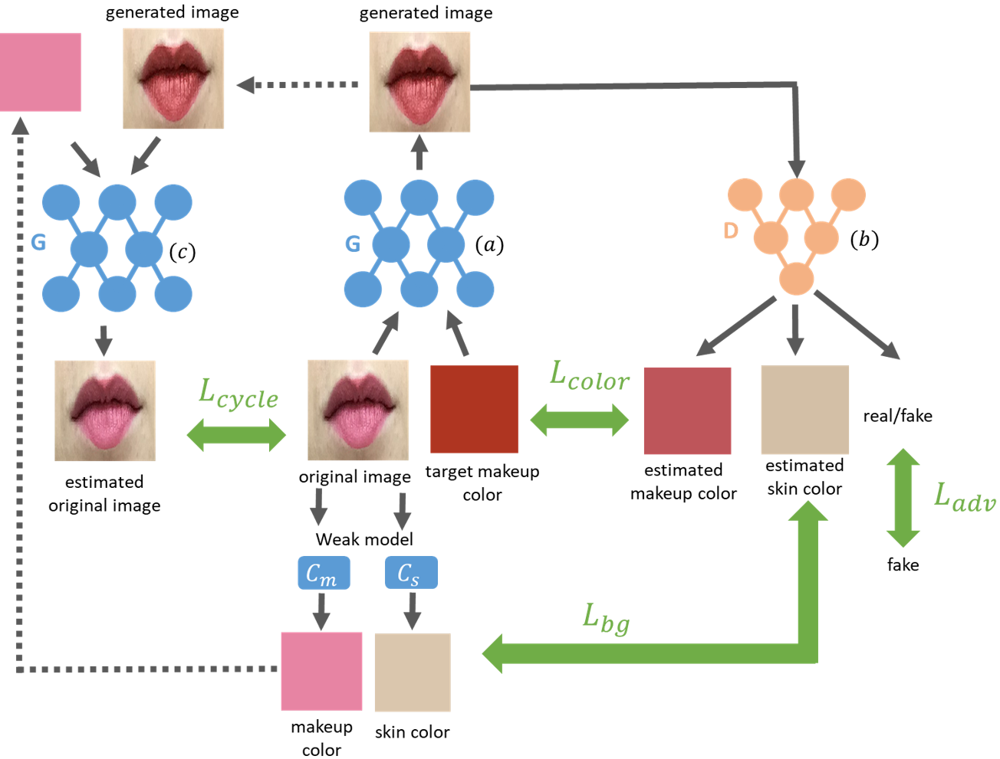

# CA-GAN: Weakly Supervised Color Aware GAN for Controllable Makeup Transfer

    <h2><a style="width: 20%;margin: 2.5%;" href="https://www.linkedin.com/in/robin-kips" target="_blank">Robin Kips</a><a style="width: 20%;margin: 2.5%;" href="https://www.linkedin.com/in/pietro-gori-b097bb118/" target="_blank">Pietro Gori</a><a style="width: 20%;margin: 2.5%;" href="https://www.linkedin.com/in/matthieu-perrot-225ab01b/" target="_blank">Matthieu Perrot</a><a style="width: 20%;margin: 2.5%;" href="https://www.linkedin.com/in/isabelle-bloch-b954144/" target="_blank">Isabelle Bloch</a></h2>

        

### Abstract:
While existing makeup style transfer models perform an image synthesis whose results cannot be explicitly controlled, the ability to modify makeup color continuously is a desirable property for virtual try-on applications. We propose a new formulation for the makeup style transfer task, with the objective to learn a color controllable makeup style synthesis. 
We introduce CA-GAN, a generative model that learns to modify the color of specific objects (e.g. lips or eyes) in the image to an arbitrary target color while preserving background. 
Since color labels are rare and costly to acquire, our method leverages
weakly supervised learning for conditional GANs. This enables to learn a controllable synthesis of complex objects, and only requires a weak proxy of the image attribute that we desire to modify.
Finally, we present for the first time a quantitative analysis of makeup style transfer and color control performance.

### Video presentation: 
Our presentation at the AIM20 workshop, in conjonction with ECCV.
<iframe style="display: block; margin: auto;" width="560" height="315" src="https://www.youtube.com/embed/3YjkkxgAIKw" frameborder="0" allow="accelerometer; autoplay; encrypted-media; gyroscope; picture-in-picture" allowfullscreen></iframe>

### Video examples:

<iframe  style="display: block; margin: auto;" width="560" height="315" src="https://www.youtube.com/embed/zA18a8-R6Wg" frameborder="0" allow="accelerometer; autoplay; encrypted-media; gyroscope; picture-in-picture" allowfullscreen></iframe>
<iframe style="display: block; margin: auto;"  width="560" height="315" src="https://www.youtube.com/embed/hHOZX6U_nqU" frameborder="0" allow="accelerometer; autoplay; encrypted-media; gyroscope; picture-in-picture" allowfullscreen></iframe>

### Paper:

Paper : [waiting for ECCV proceedings] \
ArXiv : [https://arxiv.org/abs/2008.10298](https://arxiv.org/abs/2008.10298) \
Supplementary Materials : [waiting for ECCV proceedings]

### Model Architecture:
The training procedure of our CA-GAN model. First (a) the generator G estimates an image from a source image and a target makeup color. Secondly (b) the discriminator D estimates the makeup color, skin color and a real/fake classification from the generated image, used to compute the color regression loss L_color, background consistency loss *L_bg* and adversarial loss *L_adv*, respectively. Thirdly (c), the source image is reconstructed from the generated one using the makeup color as target. The reconstruction is used to compute the cycle consistency loss *L_cycle*.
<!--  -->

	

### Results:

Modification of makeup color along each dimension of the *CIE Lab* color space, using images from our social media dataset.
The color patch on the bottom-right of each image illustrates the target color passed to the model.
Our approach generalizes to lips and eyes images with various makeup textures and facial poses.

Our model shows makeup style transfer performances that are equivalent to state of the art models, while obtaining better preservation of the skin color of the source subject.

### Other works
Check out our other paper presented at AIM (ECCV 2020): <a href="https://despoisj.github.io/AgingMapGAN/" target="_blank">https://despoisj.github.io/AgingMapGAN/</a>